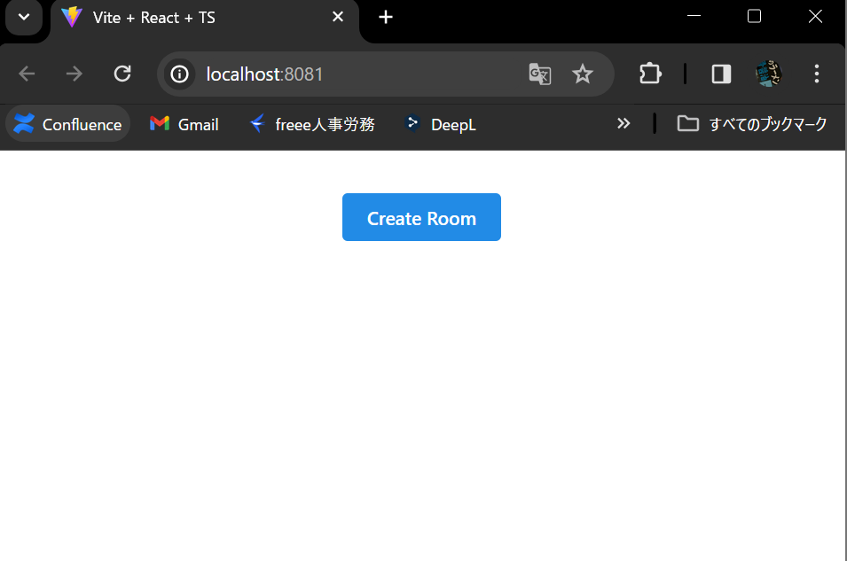

# react-QRcode

## 概要
reactの練習とQRcodeを生成するモジュールを動かすためのテストリポジトリ

## 目的のQRcodeモジュール
**qrcode.react**
> https://github.com/zpao/qrcode.react
- ダウンロードされている数が多い
> https://npmtrends.com/qr-image-vs-qrcode-vs-qrcode-generator-vs-qrcode-npm-vs-qrcode-react-vs-qrcode.react-vs-react-qr-code-vs-react-qrcodes
- reactの記法に対応している
- typescriptもサポートしている
- コミットの頻度も高く，活発に開発されてそう？
- ドキュメントが網羅的で読みやすい？

## 現時点でのこのリポジトリの内容
1. vscodeのdevcontainerで開きます．
1. `yarn dev`をターミナルで叩く

1. 下のようなサイトが開く

1. `create room`を押すと，下のような画面に遷移する．

